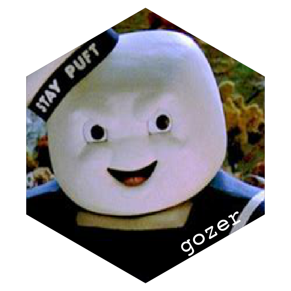
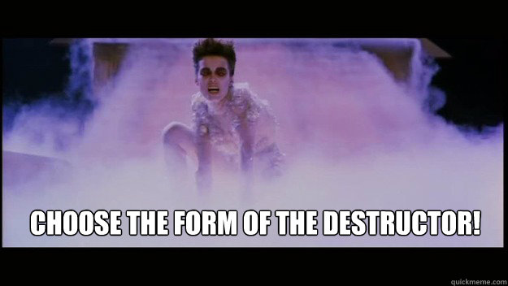

<!-- README.md is generated from README.Rmd. Please edit that file -->

```{r, include = FALSE}
knitr::opts_chunk$set(
  collapse = FALSE,
  comment = "#>",
  fig.path = "man/figures/README-",
  out.width = "100%"
)

library(gozer)
```

# gozer - choose the form of the destructor 

<!-- badges: start -->

<!-- badges: end -->

`gozer` allows you to attach  a 'destructor' artefact (a function to call or string to print) 
to an R object.

After the R object is destroyed (i.e. garbage collected) the 'destructor' artefact
is called/printed.

## What's in the box

* `gozer()` to attach a destructor artefact to an object.


## Installation

You can install from [GitHub](https://github.com/coolbutuseless/gozer) with:

``` r
# install.package('remotes')
remotes::install_github('coolbutuseless/gozer')
```


## Printing a string as a 'destructor' artefact.


```{r example1}
library(gozer)

#~~~~~~~~~~~~~~~~~~~~~~~~~~~~~~~~~~~~~~~~~~~~~~~~~~~~~~~~~~~~~~~~~~~~~~~~~~~~~
# Define an object and add a string as a destruction artefact
#~~~~~~~~~~~~~~~~~~~~~~~~~~~~~~~~~~~~~~~~~~~~~~~~~~~~~~~~~~~~~~~~~~~~~~~~~~~~~
a <- 'hello'
a <- gozer(a, 'This object has now said goodbye')
a

#~~~~~~~~~~~~~~~~~~~~~~~~~~~~~~~~~~~~~~~~~~~~~~~~~~~~~~~~~~~~~~~~~~~~~~~~~~~~~
# Destroy the object and get the destruction artefact
#~~~~~~~~~~~~~~~~~~~~~~~~~~~~~~~~~~~~~~~~~~~~~~~~~~~~~~~~~~~~~~~~~~~~~~~~~~~~~
rm(a)

invisible(gc())
```


## Calling a function as a 'destructor' artefact.


```{r example2}
library(gozer)

#~~~~~~~~~~~~~~~~~~~~~~~~~~~~~~~~~~~~~~~~~~~~~~~~~~~~~~~~~~~~~~~~~~~~~~~~~~~~~
# Function to call when object is destroyed. 
# Argument will be an external pointer object which is unusable
#~~~~~~~~~~~~~~~~~~~~~~~~~~~~~~~~~~~~~~~~~~~~~~~~~~~~~~~~~~~~~~~~~~~~~~~~~~~~~
ff <- function(env) {
  cat("There was definitely a garbage collection event for object:", env$id, "\n")
}

#~~~~~~~~~~~~~~~~~~~~~~~~~~~~~~~~~~~~~~~~~~~~~~~~~~~~~~~~~~~~~~~~~~~~~~~~~~~~~
# Define an object and add a function as a destruction artefact
#~~~~~~~~~~~~~~~~~~~~~~~~~~~~~~~~~~~~~~~~~~~~~~~~~~~~~~~~~~~~~~~~~~~~~~~~~~~~~
a <- 'hello'
a <- gozer(a, ff, id = 'test 1')
a

#~~~~~~~~~~~~~~~~~~~~~~~~~~~~~~~~~~~~~~~~~~~~~~~~~~~~~~~~~~~~~~~~~~~~~~~~~~~~~
# Destroy the object and get the destruction artefact
#~~~~~~~~~~~~~~~~~~~~~~~~~~~~~~~~~~~~~~~~~~~~~~~~~~~~~~~~~~~~~~~~~~~~~~~~~~~~~
rm(a)

invisible(gc())
```


## Related Software

* `base::reg.finalizer()`
    * Only works on environments and external pointers
    * Object is still active at the time of finalization and is the expected
      argument to the finalizer function.
* R6 'finalize' method


## Acknowledgements

* R Core for developing and maintaining the language.
* CRAN maintainers, for patiently shepherding packages onto CRAN and maintaining
  the repository


## Gozer the Gozerian




```{r eval = FALSE, echo = FALSE}
library(grid)
library(ingrid)

#~~~~~~~~~~~~~~~~~~~~~~~~~~~~~~~~~~~~~~~~~~~~~~~~~~~~~~~~~~~~~~~~~~~~~~~~~~~~~
# Parameters for a hex
#~~~~~~~~~~~~~~~~~~~~~~~~~~~~~~~~~~~~~~~~~~~~~~~~~~~~~~~~~~~~~~~~~~~~~~~~~~~~~
r     <- 100
theta <- seq(30, 360, 60) * pi/180 
x     <- r * cos(theta)
y     <- r * sin(theta)

#~~~~~~~~~~~~~~~~~~~~~~~~~~~~~~~~~~~~~~~~~~~~~~~~~~~~~~~~~~~~~~~~~~~~~~~~~~~~~
# a hex polygon
#~~~~~~~~~~~~~~~~~~~~~~~~~~~~~~~~~~~~~~~~~~~~~~~~~~~~~~~~~~~~~~~~~~~~~~~~~~~~~
hex <- polygon_grob(x, y, fill = 'black')

#~~~~~~~~~~~~~~~~~~~~~~~~~~~~~~~~~~~~~~~~~~~~~~~~~~~~~~~~~~~~~~~~~~~~~~~~~~~~~
# Create an image maskeed by the hex
#~~~~~~~~~~~~~~~~~~~~~~~~~~~~~~~~~~~~~~~~~~~~~~~~~~~~~~~~~~~~~~~~~~~~~~~~~~~~~
jpg <- jpeg::readJPEG("./man/figures/staypuft.jpg")
image <- raster_grob(
  image  = jpg, 
  x      = .mm(-0),
  y      = .mm(-20),
  width  = .mm(4 * 1.0 * r), 
  height = .mm(2.4 * 1.0 * r),
  mask   = hex
)


#~~~~~~~~~~~~~~~~~~~~~~~~~~~~~~~~~~~~~~~~~~~~~~~~~~~~~~~~~~~~~~~~~~~~~~~~~~~~~
# Position text
#~~~~~~~~~~~~~~~~~~~~~~~~~~~~~~~~~~~~~~~~~~~~~~~~~~~~~~~~~~~~~~~~~~~~~~~~~~~~~
text <- text_grob(
  label      = 'gozer',
  x          =  0.25 * r,
  y          = -0.75 * r, 
  rot        = 30,
  just       = 0,
  col        = 'white', 
  fontfamily = 'courier',
  cex        = 4
)

#~~~~~~~~~~~~~~~~~~~~~~~~~~~~~~~~~~~~~~~~~~~~~~~~~~~~~~~~~~~~~~~~~~~~~~~~~~~~~
# Draw the objects
#~~~~~~~~~~~~~~~~~~~~~~~~~~~~~~~~~~~~~~~~~~~~~~~~~~~~~~~~~~~~~~~~~~~~~~~~~~~~~
grid::grid.newpage()
grid::grid.draw(image)
grid::grid.draw(text)
```


```{r eval = FALSE, include = FALSE}
png("./man/figures/logo.png", type = 'cairo', width = 600, height = 600, bg = 'transparent')
grid::grid.newpage()
grid::grid.draw(hex)
grid::grid.draw(image)
grid::grid.draw(text)
invisible(dev.off())
```
