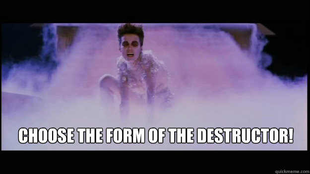

<!-- README.md is generated from README.Rmd. Please edit that file -->

# gozer - choose the form of the destructor 

<!-- badges: start -->


<!-- badges: end -->

`gozer` allows you to attach a ‘destructor’ artefact (either a string or
a function) to an R object.

When the R object is destroyed (i.e. garbage collected) the ‘destructor’
artefact is printed or called.

## What’s in the box

-   `gozer()` to attach a destructor artefact to an object.

## Installation

You can install from [GitHub](https://github.com/coolbutuseless/gozer)
with:

``` r
# install.package('remotes')
remotes::install_github('coolbutuseless/gozer')
```

## Printing a string as a ‘destructor’ artefact.

``` r
library(gozer)

#~~~~~~~~~~~~~~~~~~~~~~~~~~~~~~~~~~~~~~~~~~~~~~~~~~~~~~~~~~~~~~~~~~~~~~~~~~~~~
# Define an object and add a string destruction artefact
#~~~~~~~~~~~~~~~~~~~~~~~~~~~~~~~~~~~~~~~~~~~~~~~~~~~~~~~~~~~~~~~~~~~~~~~~~~~~~
a <- 'hello'
a <- gozer(a, "I was garbage collected! Goodbye ...")

#~~~~~~~~~~~~~~~~~~~~~~~~~~~~~~~~~~~~~~~~~~~~~~~~~~~~~~~~~~~~~~~~~~~~~~~~~~~~~
# Destructor is added as object attribute as a NULL external pointer on t
#~~~~~~~~~~~~~~~~~~~~~~~~~~~~~~~~~~~~~~~~~~~~~~~~~~~~~~~~~~~~~~~~~~~~~~~~~~~~~
a
```

    #> [1] "hello"
    #> attr(,"destructor")
    #> <pointer: 0x0>
    #> attr(,"class")
    #> [1] "gozer"

``` r
#~~~~~~~~~~~~~~~~~~~~~~~~~~~~~~~~~~~~~~~~~~~~~~~~~~~~~~~~~~~~~~~~~~~~~~~~~~~~~
# Destroy the object and get the destruction artefact
#~~~~~~~~~~~~~~~~~~~~~~~~~~~~~~~~~~~~~~~~~~~~~~~~~~~~~~~~~~~~~~~~~~~~~~~~~~~~~
rm(a)
invisible(gc())
```

    #> I was garbage collected! Goodbye ...

## Calling a function as a ‘destructor’ artefact.

``` r
library(gozer)

#~~~~~~~~~~~~~~~~~~~~~~~~~~~~~~~~~~~~~~~~~~~~~~~~~~~~~~~~~~~~~~~~~~~~~~~~~~~~~
# Funciton to call when object is destroyed. 
# Argument will be an external pointer object which is unusable
#~~~~~~~~~~~~~~~~~~~~~~~~~~~~~~~~~~~~~~~~~~~~~~~~~~~~~~~~~~~~~~~~~~~~~~~~~~~~~
ff <- function(ext_ptr) {
  print("There was definitely a garbage collection event")
}

#~~~~~~~~~~~~~~~~~~~~~~~~~~~~~~~~~~~~~~~~~~~~~~~~~~~~~~~~~~~~~~~~~~~~~~~~~~~~~
# Define an object and add a function as a destruction artefact
#~~~~~~~~~~~~~~~~~~~~~~~~~~~~~~~~~~~~~~~~~~~~~~~~~~~~~~~~~~~~~~~~~~~~~~~~~~~~~
a <- 'hello'
a <- gozer(a, ff)
a
```

    #> [1] "hello"
    #> attr(,"destructor")
    #> <pointer: 0x0>
    #> attr(,"class")
    #> [1] "gozer"

``` r
#~~~~~~~~~~~~~~~~~~~~~~~~~~~~~~~~~~~~~~~~~~~~~~~~~~~~~~~~~~~~~~~~~~~~~~~~~~~~~
# Destroy the object and get the destruction artefact
#~~~~~~~~~~~~~~~~~~~~~~~~~~~~~~~~~~~~~~~~~~~~~~~~~~~~~~~~~~~~~~~~~~~~~~~~~~~~~
rm(a)
invisible(gc())
```

    #> [1] "There was definitely a garbage collection event"

## Related Software

-   `base::reg.finalizer()`
    -   Only works on environments and external pointers
    -   Object is still active at the time of finalization and is the
        expected argument to the finalizer function.
-   R6 ‘finalize’ method

## Acknowledgements

-   R Core for developing and maintaining the language.
-   CRAN maintainers, for patiently shepherding packages onto CRAN and
    maintaining the repository

## Gozer the Gozerian


